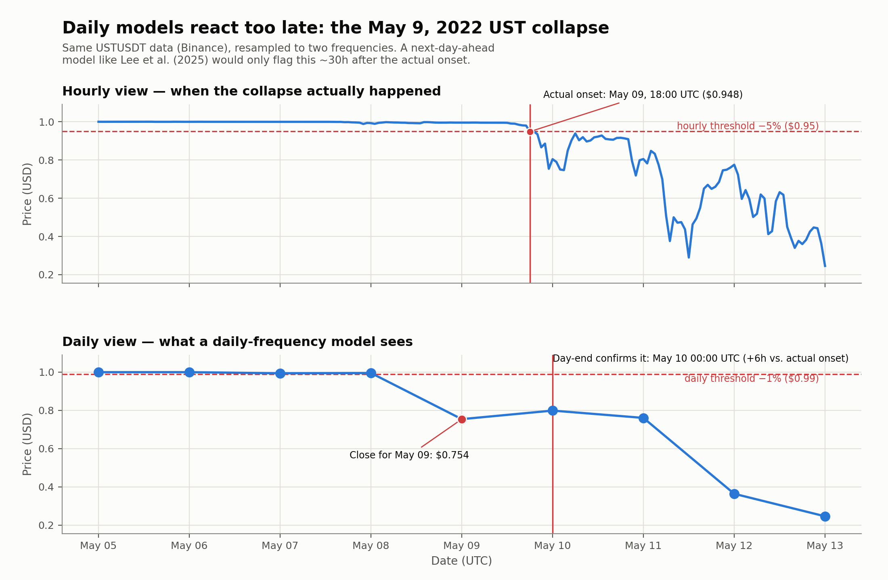

# Workstream 1: Literature Replication & Shortcomings

Two scripts, both targeting the same paper — Lee, Y.-H., Chiu, Y.-F., & Hsieh, M.-H. (2025). *Stablecoin depegging risk prediction.* Pacific-Basin Finance Journal, 90, 102640 — from opposite directions:

| Script | Question it answers |
|---|---|
| [`lee_et_al_replication.py`](lee_et_al_replication.py) | Can we reproduce their method and their headline result? |
| [`daily_vs_hourly_ust_shortcoming.py`](daily_vs_hourly_ust_shortcoming.py) | Even if we can, what does their daily-frequency design structurally miss? |

Run either from the repo root, inside the project `.venv`:
```bash
cd stablecoin-depegging-analysis
.venv\Scripts\Activate.ps1        # or activate.bat / source .venv/bin/activate
python models/lee_et_al_replication.py
python models/daily_vs_hourly_ust_shortcoming.py
```

---

## 1. Replication — `lee_et_al_replication.py`

**Scope** (Workstream 1 brief): *"Run a simple Logistic Regression and Random Forest using daily price/volatility indicators. Produce a table showing their baseline accuracy/ROC-AUC."*

### What the paper did
- **Coins**: USDT, USDC, BUSD, DAI + BTC/ETH as spillover regressors.
- **Period**: Jan 1, 2022 – Dec 31, 2023, daily frequency (730 rows/coin).
- **Label** — a *dynamic*, volume-scaled depeg threshold (their headline contribution):
  ```
  ThreshD_t = 1 − 10 / V_monthly_t^(1/3)
  ThreshU_t = 1 + 10 / V_monthly_t^(1/3)
  Y_t = 1  if  P_low_t ≤ ThreshD_t  or  P_high_t ≥ ThreshU_t
  ```
  `V_monthly` is the trailing 30-day sum of trading volume — high-volume coins get a tighter band, low-volume coins a looser one. Bilateral (catches both up- and down-depegs).
- **Features**: 66 variables lagged by 1 day across 4 blocks — price/volume % change, market-cap/supply % change, sentiment (Fear & Greed, Sentiment, Awareness indices), volatility (Realized Daily Volatility, Price Deviation, Downward Price Deviation) — each block repeated for the coin itself, BTC, and ETH.
- **Models**: Logistic Regression, Random Forest, XGBoost; SMOTE applied only to low-depeg-rate coins (USDC, DAI).
- **Split**: **stratified random sampling on the label** — explicitly *not* time-based.
- **Metrics**: Accuracy, Precision, Recall, F1 (primary), Specificity.

### What we replicated, and why not everything

| Component | Replicated? | Notes |
|---|---|---|
| Dynamic threshold label (Y equation) | **Yes, exactly** | Same formula, same constants (α=1/3, K=10). |
| Price/volume change-rate features | **Yes** | 1d/7d/30d instead of 1h/24h/7d/30d — daily data only, no 1h analogue. |
| Volatility features | **Yes** | Realized Daily Volatility (Rogers-Satchell), Price Deviation & Downward Price Deviation (5d/30d). |
| BTC/ETH spillover features | **Yes, partial** | Price/volume change + Realized Daily Volatility for BTC/ETH. *Not* peg-deviation features for BTC/ETH — "distance from $1" is meaningless for a non-pegged asset, a deliberate correction over a literal reading of their Table 1. |
| Market-cap/supply, sentiment features | No | No free data source covers these; sentiment also wasn't predictive in their own results (didn't make their top-15 feature list). |
| Logistic Regression, Random Forest | **Yes** | XGBoost dropped — out of scope per brief. |
| Train/test split: stratified random | **Yes, deliberately** | Copied *as-is*, flaws included — see §1.3. |
| SMOTE | **No, deliberately** | Brief asked for "simple" LR/RF; watching them fail on imbalanced coins without it is itself evidence for the shortcomings case. |
| Sample period | **Yes** — Jan 2022 to Dec 2023 | 729 rows vs. their 730. |
| Coin roster | **Yes, plus extras** | USDT/USDC/BUSD/DAI all included, plus PAX, USTC, WLUNA — the latter two are the algorithmic coins Lee et al. excluded entirely. |

**Data source**: everything (price *and* volume, for every asset) comes from **Yahoo Finance** (`data/ohlcv/*_ohlcv.csv`, gitignored, 2021-11-15 → 2023-12-31 — a ~45-day lookback margin before the analysis window so 30-day rolling features are already full on day one). We initially tried this project's other raw dataset (`ERC20-stablecoins/price_data/`), but it has **no volume column** (the label formula needs it) and only spans Apr–Nov 2022 — a genuine gap, not a design choice. CoinGecko's free API — the more obvious fix — now refuses to serve data older than 365 days, which is why Yahoo Finance stands in for the paper's actual source (CoinMarketCap).

### Results

**Label summary** (2022-01-01 → 2023-12-30, matching their period almost exactly — 729 rows vs. their 730):

| coin | n_obs | n_depeg_days | our depeg_rate | Lee et al.'s rate |
|---|---|---|---|---|
| usdt | 729 | 179 | 24.6% | 23.0% |
| usdc | 729 | 49 | 6.7% | 2.2% |
| dai | 729 | 14 | 1.9% | 1.9% |
| pax | 729 | 17 | 2.3% | n/a (not in paper) |
| busd | 729 | 208 | 28.5% | 26.4% |
| ustc | 729 | 658 | 90.3% | n/a (excluded by paper) |
| wluna | 281 | 281 | 100.0% | n/a (excluded; Yahoo's price history for this ticker ends Oct 2022) |

**Model performance** (stratified random split, faithful to their Table 5 method):

| coin | model | accuracy | precision | recall | F1 | specificity | ROC-AUC |
|---|---|---|---|---|---|---|---|
| usdt | Logistic Regression | 0.781 | 0.875 | 0.130 | 0.226 | 0.994 | 0.612 |
| usdt | Random Forest | 0.909 | 0.854 | 0.759 | **0.804** | 0.958 | 0.943 |
| usdc | Logistic Regression | 0.936 | 0.667 | 0.133 | 0.222 | 0.995 | 0.595 |
| usdc | Random Forest | 0.945 | 1.000 | 0.200 | **0.333** | 1.000 | 0.947 |
| dai | Logistic Regression | 0.968 | 0.000 | 0.000 | 0.000 | 0.986 | 0.690 |
| dai | Random Forest | 0.977 | 0.000 | 0.000 | 0.000 | 0.995 | 0.820 |
| pax | Logistic Regression | 0.977 | 0.000 | 0.000 | 0.000 | 1.000 | 0.615 |
| pax | Random Forest | 0.977 | 0.000 | 0.000 | 0.000 | 1.000 | 0.612 |
| busd | Logistic Regression | 0.831 | 0.931 | 0.435 | 0.593 | 0.987 | 0.767 |
| busd | Random Forest | 0.918 | 0.844 | 0.871 | **0.857** | 0.936 | 0.967 |
| ustc | Logistic Regression | 0.936 | 0.965 | 0.965 | 0.965 | 0.667 | 0.973 |
| ustc | Random Forest | 0.982 | 0.985 | 0.995 | **0.990** | 0.857 | 0.997 |
| wluna | — | — | — | — | — | — | single-class target, no model fit possible |

Also saved to [`lee_replication_label_summary.csv`](lee_replication_label_summary.csv) and [`lee_replication_results.csv`](lee_replication_results.csv).

### 1.3 Interpretation — did it replicate?

**Yes — on both the mechanism and the core empirical finding.**

- **Depeg rates track theirs closely**: DAI 1.9% (theirs 1.9%, exact), USDT 24.6% (theirs 23.0%), BUSD 28.5% (theirs 26.4%). USDC comes out higher (6.7% vs. 2.2%) — plausibly a genuine Yahoo-vs-CoinMarketCap disagreement on intraday high/low, since every other coin lines up well.
- **RF beats LR on every well-populated coin**, reproducing their headline claim directly: USDT (F1 0.804 vs 0.226), BUSD (0.857 vs 0.593), USDC (0.333 vs 0.222).
- **DAI and PAX collapse to F1 = 0 for both models** — expected, not a failure: their depeg rates (1.9%, 2.3%) are low enough that "always predict no depeg" is the easy way out without SMOTE, which we deliberately left out. This is exactly the problem Lee et al. built SMOTE to solve.
- **USTC/WLUNA can't be benchmarked against the paper** (both excluded from their study) but are the most useful result for our own purposes — see §3.

---

## 2. Shortcoming — `daily_vs_hourly_ust_shortcoming.py`

**Scope** (Workstream 1 brief, deliverable 2a): *"Show that daily models react too late to intraday crashes (plot the daily vs. hourly view of the May 9 UST collapse)."*

### Method
Lee et al.'s design (and most of the depeg-prediction literature) is **daily**: one row per coin per day, predicting tomorrow's depeg from today's features. This script asks what that design can't see: what did the UST collapse actually look like *within* the days their model treats as single observations, and how much later does a daily view notice it?

- **Data**: Binance's `USTUSDT` klines, 1h interval, May 5–14 2022 (`data/hourly/ustusdt_hourly_may2022.csv`, gitignored). Neither Yahoo Finance (hourly history only reaches ~2 years back from *today*) nor CoinGecko's free tier (>365-day wall, same as §1) can serve this; Binance has no such restriction and still has UST's full trading history up to its mid-2022 delisting.
- **Both frequencies come from the same pull**: the "daily" series is the hourly data resampled to daily OHLC ourselves, not a separately-sourced daily feed — avoiding the cross-vendor disagreement noted for USDC in §1.
- **Threshold, at each frequency's own literature-recommended tightness**: Cintra & Holloway (2023) — cited by Lee et al. as prior work — recommend a *tighter* band for finer-grained data specifically to control noise: **5% for hourly, 1% for daily**. We use exactly those two numbers, so the comparison is "each frequency's own honest threshold," not an unfair single band applied at two resolutions.
- **Detection is defined the same way at both frequencies**: the first close price to cross the threshold. For daily, that day's close (hence its "detection") isn't knowable until the day ends — an extra structural delay that hourly detection doesn't have.

### Result

| Event | Timing | Price |
|---|---|---|
| **Actual onset** (first hourly close ≤ −5%) | May 9, 18:00 UTC | $0.948 |
| **Daily view confirms it** (day-end close ≤ −1%) | May 10, 00:00 UTC | $0.754 (May 9's close) |
| **Lee et al.'s model would flag it** (predicts day *t+1* from day *t*'s features) | May 11, 00:00 UTC | — |

- Raw daily-close lag: **6 hours**
- Lee et al.'s actual next-day-ahead design: **~30 hours** after the true onset — by which point UST had already dropped to $0.75, briefly recovered to $0.92, and was on its way to $0.25.

Figure: [`figures/daily_vs_hourly_ust.png`](figures/daily_vs_hourly_ust.png) — two stacked panels (hourly / daily) on the same time axis and price scale, with the threshold, breach point, and detection lag directly labeled on each.



### Why this matters
The 6h→30h escalation is worth stating as two separate numbers on the slide: the raw frequency gap (6h) understates how late Lee et al.'s *specific* next-day-ahead design reacts once you account for their own forecasting setup, not just their data's granularity.

One naming note: this uses UST's original ticker (`USTUSDT`), not the renamed `USTC` used in §1 — `USTUSDT` is the only symbol with real hourly trade history through the actual May 2022 collapse window (the USTC rename came after).

---

## 3. How the two scripts connect

Both surface the same underlying problem from different angles, and together make the case that a professor's feedback flagged directly: **Lee et al.'s daily, stratified-random-split design cannot distinguish "many independent bad days" from "one very long bad day."**

- In §1, USTC and WLUNA show ~90–100% depeg rates over our sample window — not because either coin generated hundreds of independent crisis days, but because most of their remaining trading history sits *after* the May 9 collapse, so nearly every subsequent day is trivially still "depegged." One episode, counted as if it were hundreds of observations.
- In §2, the same collapse is shown to already be underway *hours* before the first day a daily model would even register it — and a full ~30 hours before Lee et al.'s own model, with its next-day-ahead design, would flag anything at all.

Two concrete shortcomings for the presentation, both demonstrated on our own numbers rather than asserted:
1. **No episode structure** — a per-day label inflates one multi-month collapse into hundreds of "independent" positive observations.
2. **Daily granularity + random split** — even setting episode-grouping aside, a daily-frequency, next-day-ahead design is structurally hours-to-days slower than the actual event, and a random (non-chronological) split can leak information across a crash's own timeline.
